# Numpad
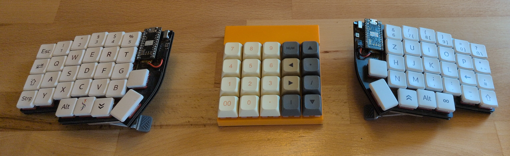
My version of a simple handwired 4x5 numpad with the xiao nrf52840 running zmk. This repo includes the 3d model and basic build steps.

## 3d model

The 3D model is designed to be printed without supports. The structural elements fulfill their function.
The 3D model was created with build123d. It was my first bigger project with it, so the code is not optimized and by now takes a long time to run.

## Bill of material
| Amount | Component |
| ------ | --------- |
| 1      | xiao nrf52840 |
| 1      | battery 102050 3.7V 1000 mAh |
| 1      | power switch around 8.8 x 4 x 3.8 mm with 4 mm lever |
| 20     | switches and keycaps |
| 20     | diodes 1N4148 |
| 4      | m2 screws 6 mm long |
|        | enameled wire (or any other wire) |

<table>
  <tr>
    <td align="center">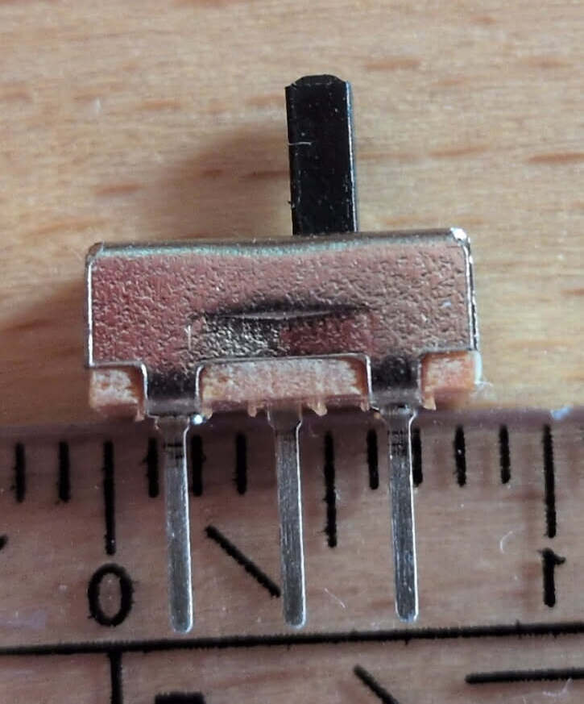</td>
    <td align="center">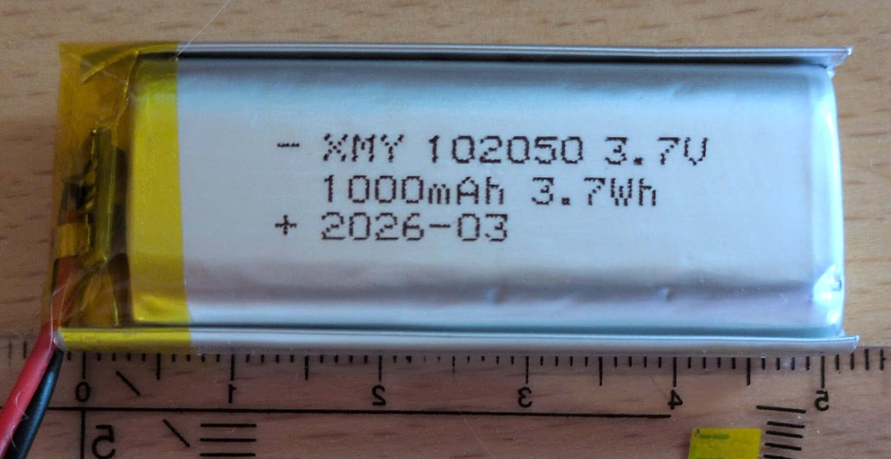</td>
  </tr>
</table>

## Build Steps

First cut free the latch, that will later hold the xiao (from the back in the top right corner). 
Prepare the xiao by soldering the enameled wire and battery to it, the power switch should be wired into the positive battery cable. Test the cable length. Then click the xiao into place and put in the power switch and battery. The power switch is hold in place by a small 3d printed plate (numpad_power_plate).
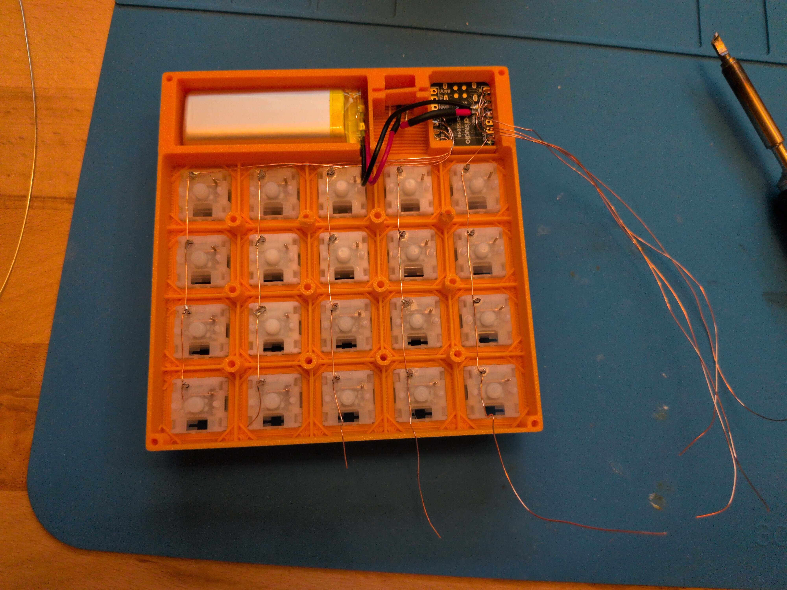
Now put in the switches and start with wiring the switches. I used enameled wire to save my self the trouble of stripping isolation. Start by wrapping the cable for the columns around the switch contacts and soldering them in place.
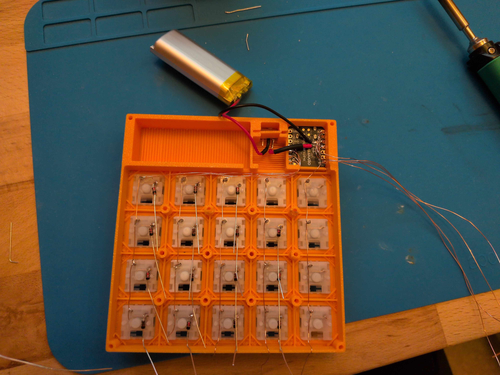
The twist the not-marked end of the diodes and solder them to the other switch contacts.
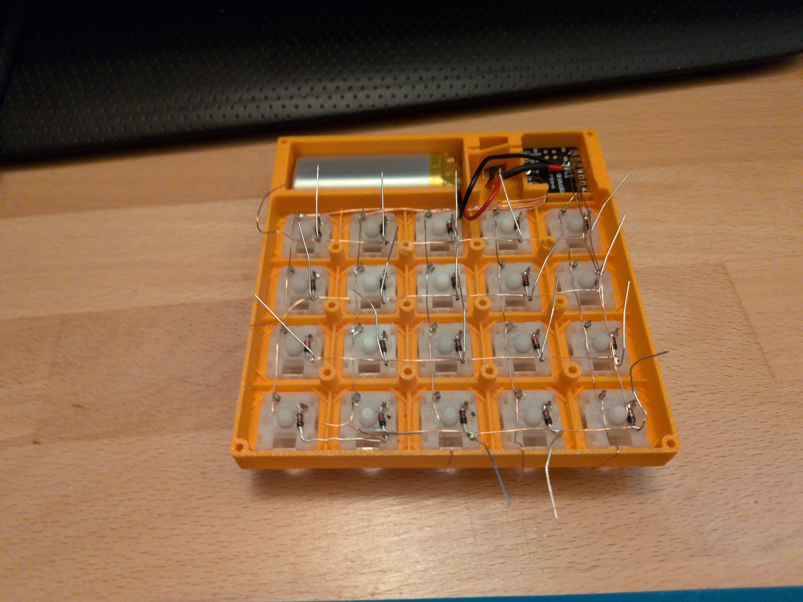
Bend the free end of the diodes upward, wrap the row wires around them and solder those as well. (My last wire was a bit to short, so I used the leg of the diode to bridge the distance.)
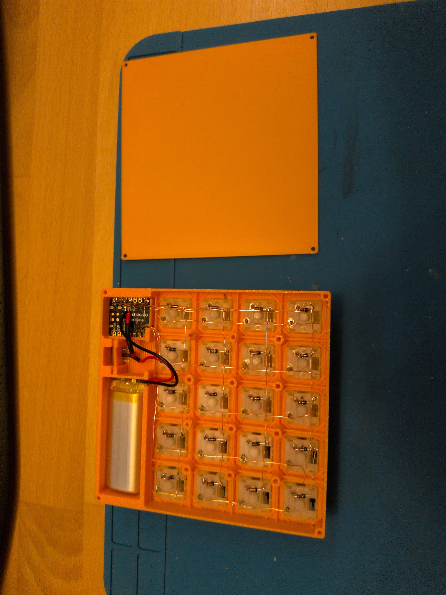
Now you can trim any excess wire and screw in the backplate at the four corners.

> To flash zmk firmware you need to shortcut the gnd and rst pin of the xiao, without the backplate this can be done with tweezers. In hindsight a reset button in the case would have been nice.

After putting on the keycaps the numpad should look something like this:
<table>
  <tr>
    <td align="center">
      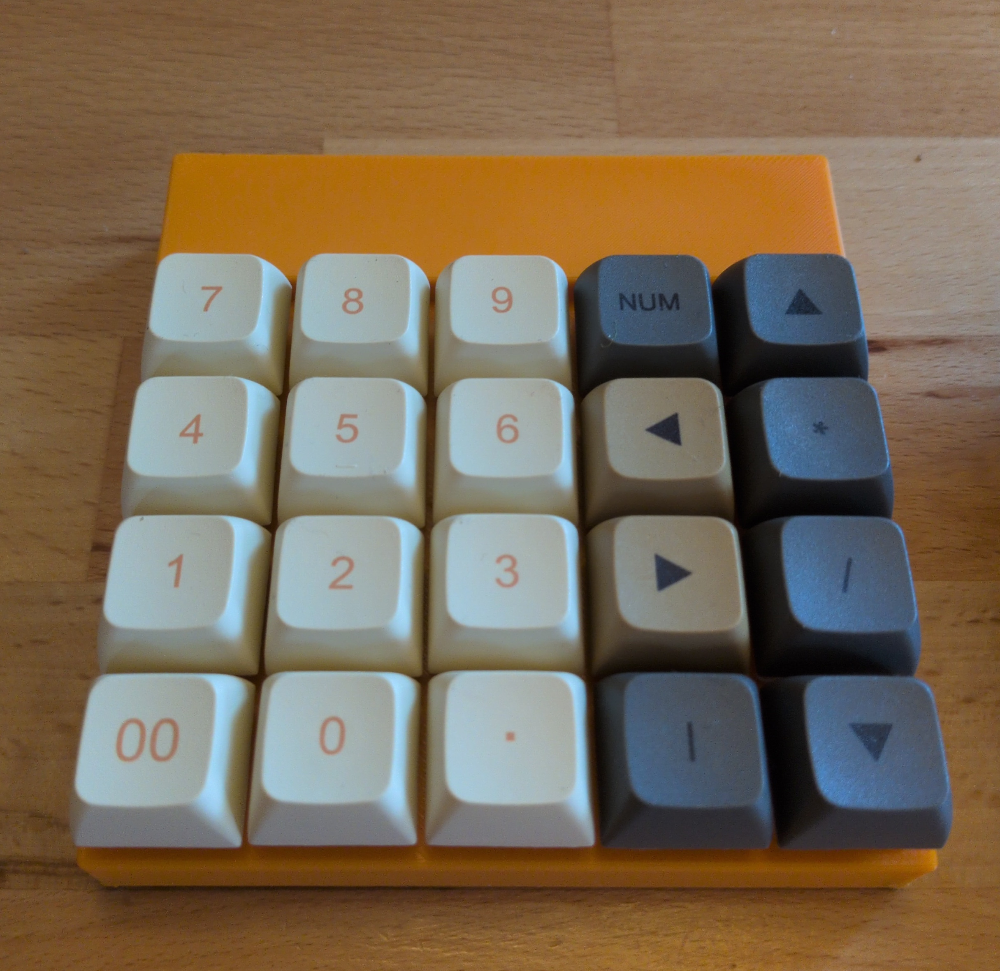
    </td>
    <td align="center">
      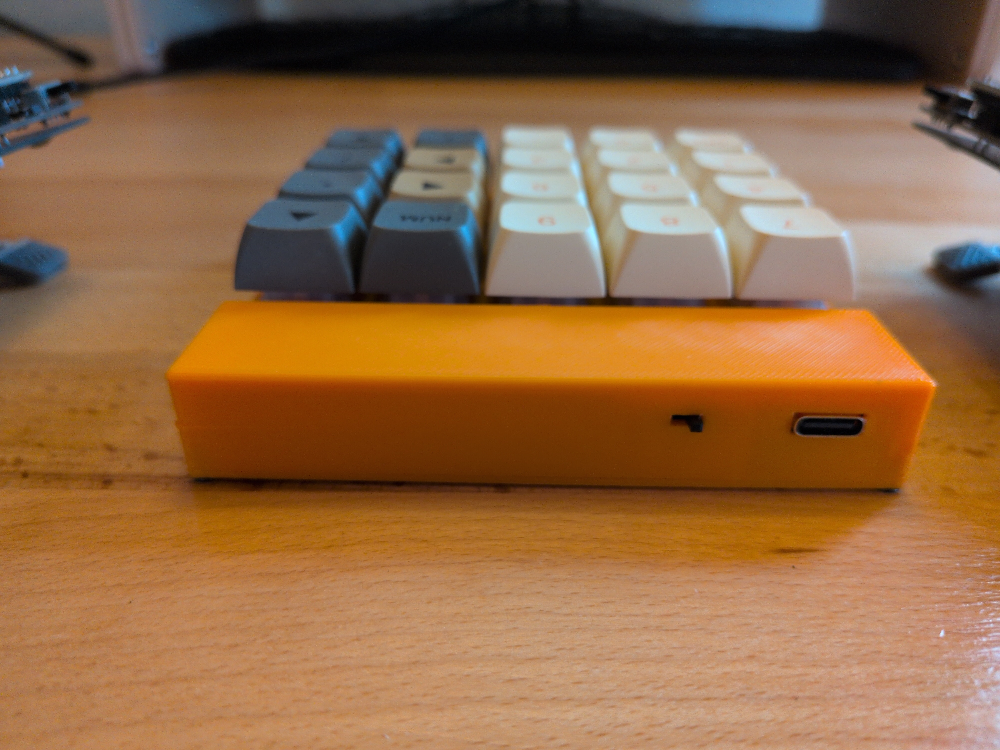
    </td>
  </tr>
  <tr>
    <td align="center">
      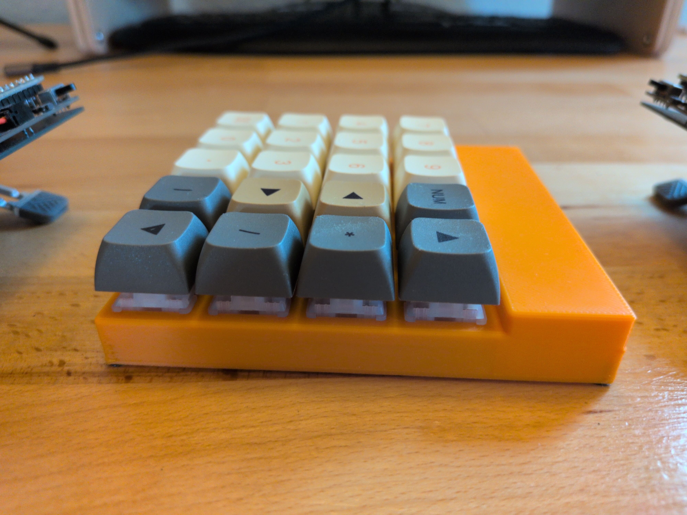
    </td>
    <td align="center">
      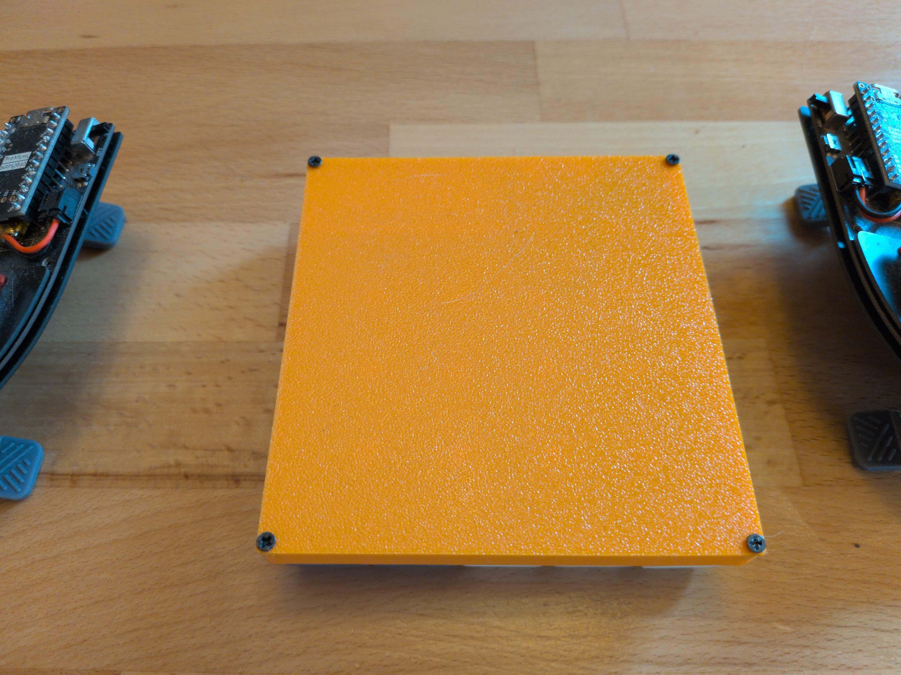
    </td>
  </tr>
</table>